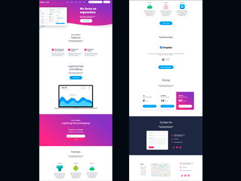

<h1 align="center">🔥 Desafio de criação de uma página responsiva 🔥</h1>

Site criado para testar os meus conhecimentos de html & css. 
Com algumas metas a serem atingidas como faze-lo ser responsivo e utilizando display: FlexBox;.

 

 
<h2>🔗 Link da refêrencia.</h2>
<a href="https://www.figma.com/community/file/827586808267348858">Figma</a>
  
<h2>📈 Com esse projeto aprendi:</h2>
1️⃣ Utilizar FlexBox. 
2️⃣ Fazer commits no GitHub. 
3️⃣ Criar um site responsivo. 
4️⃣ Mexer com gradientes no css. 
 
<h2>💻 Printscreen</h2>
<a href="https://ibb.co/y5WL6wq">Desktop Print</a> 
<a href="https://ibb.co/3CnhnYT">Mobile Print</a>
  
<h2>✅ Criado com:</h2>
✔️ Html5  
✔️ Css3
  
<h2>🔧 Créditos</h2>
<a href="http://figmaland.com">FigmaLand</a>
  

